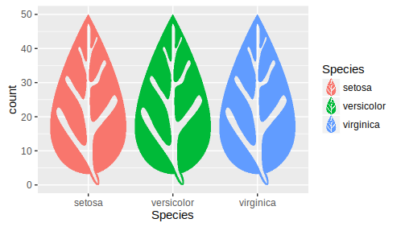

# ggpic

`ggpic` extends `ggplot2` package adding geoms based on the the default ones, but
using raster objects instead of rect elements. This way you can make a barplot
with trees, buildings or leaves instead bars.

## Usage

```r
# libraries
library(ggplot2)
library(ggpic)
library(dplyr)

# pic
leaf <- as.matrix(as.raster(rsvg::rsvg(
  system.file('pics', 'leaf.svg', package = 'ggpic')
)))

# plot
iris %>%
  ggplot(aes(x = Species, fill = Species)) +
  geom_bar_pic(pic = 'leaf')
```



## Installation

`ggpic` is only at GitHub at the moment. You can install it using `devtools`
package:

```r
# install devtools if necessary
install.packages('devtools')

# install ggpic
devtools::install_github('MalditoBarbudo/ggpic', build_vignettes = TRUE)
```

## Components:

+ `geom_bar_pic` A function to emulate `geom_bar` with *pics*

+ `scale_pic_manual` A scale function for *pics*

+ `draw_key_pic` A guide function to be able to generate legends for the *pics*

## Features

+ Example pics in the packages, see
  `dir(system.file('pics', package = 'ggpic'))`, but not limited to those as pics
  can be loaded from any raster object.

+ Geoms (*only geom_bar_pic is implemented at the moment*) can make use of most
  of the aesthetics or parameters related to their ggplot "parent" geom, i.e
  `fill` or `width` in `geom_bar_pic`.

## See more

For more examples and a complete description of the package
see the *Introduction to ggpic* vignette:

```r
vignette('Introduction to ggpic', package = 'ggpic')
```

## Known issues

### flexdashboards

`ggpic` does not work well in a `flexdashboard` environment, even if it works
in `Rmd` documents. Not sure why this is happening yet.